## **การจัดเก็บไฟล์ในรายวิชา**


ให้นักศึกษาสร้าง Directory ต่อไปนี้ใน Google Drive เพื่อเก็บงานในรายวิชานี้

1) ใน Google Drive นักศึกษาจะพบกล่อง "Colab Notebooks" ในกล่องนี้ให้สร้างกล่องเพิ่มเติมชื่อว่า "DataScience" สำหรับเก็บโค้ดของ Colab Notebook ทั้งหมดของวิชานี้

    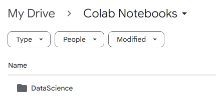


2) ภายในกล่อง "DataScience" ให้สร้างกล่องชื่อ "Datasets" เพื่อเก็บข้อมูลที่ใช้ในรายวิชานี้

    

3) การสร้างไฟล์ ipynb (IPython Notebook) ใหม่ผ่าน Google Drive ให้คลิ๊กขวาในกล่อง "DataScience" เลือก More และเลือก Google Colaboratory เพื่อสร้างเอกสาร IPython Notebook ใหม่ดังภาพประกอบ

    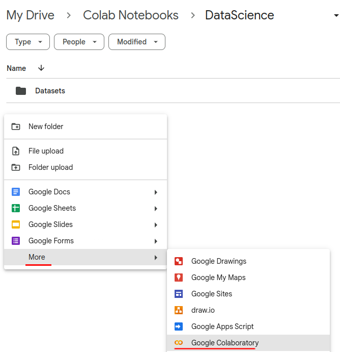

    เมื่อ Notebook ใหม่ถูกสร้างและเปิดขึ้นมาแล้ว ทำการตั้งชื่อไฟล์ ในตัวอย่างจากภาพประกอบจะตั้งชื่อไฟล์ว่า "00_intro_colab"

    
    
    จะเห็นว่าเมื่อย้อนกลับไปยัง Google Drive ไฟล์ที่สร้างใหม่จะอยู่ใน Google Drive ของวิชาแล้ว และชื่อจะเป็นไปตามชื่อไฟล์ที่ตั้งไว้ (00_intro_colab.ipynb)

    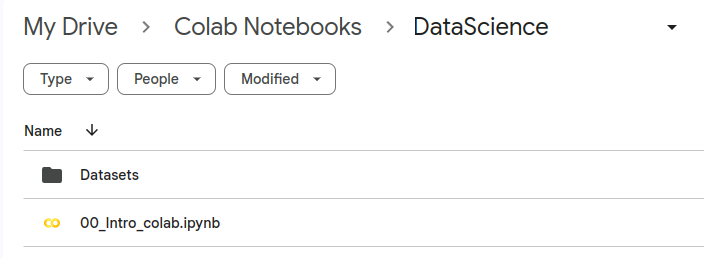

## **เริ่มต้นการทำงานด้วย IPython Notebook**
ในการใช้งาน Google Colab จะเป็นลักษณะของการเขียนสมุดโน๊ตผสมกับโค้ดของโปรแกรม ทำให้เราสามารถสร้างเอกสารที่มีคำอธิบายและโค้ดโปรแกรมซึ่งสามารถรันเพื่อแสดงผลลัพธ์ควบคู่กันไปได้ โดยมีการทำงานในส่วนต่าง ๆ ดังนี้

### การทำงานของ Cell
* การทำงานของ IPython Notebook จะเป็นลักษณะของการสร้าง Cell โดยสามารถสร้าง Cell จำนวนเท่าไหรก็ได้ตามต้องการ

    

* Cell จะมี 2 ประเภท คือ Code และ Text โดยสามารถเพิ่มจากเมนูด้านบนสุด หรือระหว่าง Cell ก็ได้ดังภาพประกอบ

    

    

* Cell แบบ Code จะใช้สำหรับโค้ดภาษาโปรแกรมเท่านั้น และสามารถรันเพื่อทำงานได้โดยการกดปุ่มหน้า Cell ดังภาพ

    

    เมื่อทำการรันผลแล้ว ผลลัพธ์จะแสดงด้านล่างของ Cell นั้น ๆ สำหรับตัวเลขหน้า Cell แบบ Code บอกถึงลำดับที่ถูกสั่งรัน

    

* Cell แบบ Text จะใช้สำหรับเขียนข้อความโดยสามารถจัดรูปแบบของข้อความได้ ในระหว่างเขียนผลลัพธ์จะแสดงด้านซ้ายมือ

    

    เมื่อเขียนข้อความเสร็จแล้วใน Cell จะแสดงเพียงผลลัพธ์ของข้อความให้เห็นเท่านั้น ดังภาพ
    

### เกี่ยวกับ Runtime และการรันโปรแกรม
ใน Google Colab จะมีเมนู Runtime ซึ่งจะสามารถใช้ในการสั่งรันโค้ดได้ เช่น 
* Run all รันโค้ดทั้งหมด โดยผู้ใช้ไม่ต้องเสียเวลากดรันทีละ Cell 
* Run before รันโค้ดก่อน Cell ที่ Cursor เลือกอยู่ 
* Run after รันโค้ดหลัง Cell ที่ Cursor เลือกอยู่ 
* Restart session เริ่มต้นการทำงานใหม่ โดยผลลัพธ์ที่เคยรันผลไว้ก่อนหน้าจะถูกเครียร์ออกไปด้วย 

    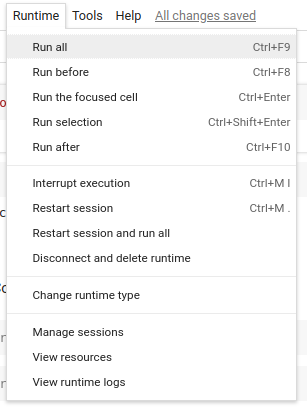

* Change runtime type สามารถกำหนดภาษาที่ใช้ทำงานและ Hardware accelerator โดยเฉพาะเมื่อต้องประมวลผลเกี่ยวกับภาพควรเปลี่ยนเป็น GPU เพื่อให้เกิดประสิทธิภาพที่ดีขึ้น

    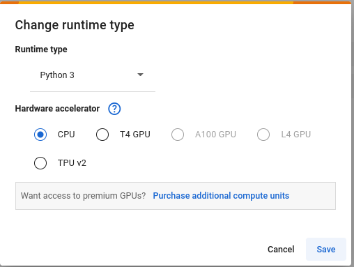

### สารบัญ (Table of contents)
สำหรับเมนูสารบัญจะเป็นเมนูด้านซ้ายมือ ซึ่งแสดงสารบัญหรือหัวข้อต่าง ๆ ใน Notebook โดยสามารถเลือกแสดงบางหัวข้อและซ่อนบ้างหัวข้อไว้ได้ เพื่อความรวดเร็วในการทำงานการกำหนดหัวข้อทำให้เราสามารถเข้าถึงหัวข้อนั้น ๆ จากสารบัญได้

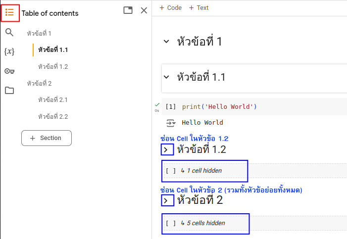

ในการกำหนดหัวข้อจะใช้สัญลักษณ์ # หน้าหัวข้อใน Cell แบบ Text หากมีหัวข้อย่อยลงไปอีกให้ทำการเพิ่มจำนวน # เข้าไป ดังตัวอย่าง


### การค้นหาและแทนที่ (Find and replace)
เมนูการค้นหาช่วยในการค้นหาข้อความทั้งใน Code และ Text และสามารถเลือกแทนที่ข้อความเหล่านั้นได้

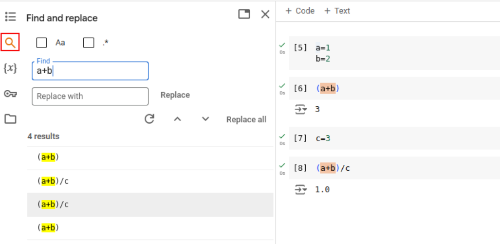

### แสดงตัวแปร (Variables)
เมนูตัวแปรจะใช้เพื่อแสดงตัวแปรเฉพาะที่ทำงานอยู่ในตอนนั้น

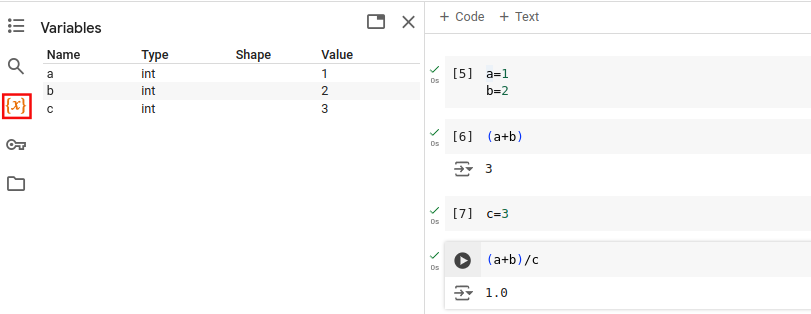

### ตัวแปรระบบ (Configuration)
ใช้ในการเก็บตัวแปรที่เป็นการกำหนดค่าของระบบ เช่น คีย์ลับ หรือ คีย์ในการเข้าใช้งานบริการภายนอก ซึ่งไม่ควรเขียนไว้ในโค้ดตรง ๆ ดังตัวอย่างในภาพมีการกำหนดคีย์ลับในชื่อว่า secret_code ซึ่งสามารถทำการอ่านขึ้นมาเพื่อใช้งานได้


### จัดการไฟล์และโฟลเดอร์ (Files)
เมนูไฟล์จะใช้แสดงไฟล์ที่อยู่ในการทำงาน โดยไฟล์เหล่านี้หากไม่ได้มีการเชื่อมต่อกับ Google Drive เพื่อจัดเก็บก็จะหายไปเมื่อ Session หมดอายุ

ดังนั้นหากต้องการเชื่อมต่อกับ Google Drive สามารถทำได้โดยกดปุ่มเพื่อ Mount Google Drive เข้ามาเป็นส่วนหนึ่งของไฟล์และโฟลเดอร์ที่ทำงานดังภาพ ในการเชื่อมต่อจะมีการขออนุญาตเพื่อเข้าถึง Google Drive จะต้องอนุญาตในทุกหัวจึงจะใช้งานได้

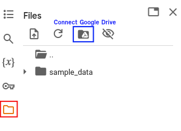


เมื่อมีการเชื่อมต่อแล้วจะปรากฏโฟลเดอร์ชื่อว่า drive ดังภาพ

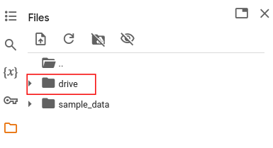

สำหรับโฟลเดอร์รายวิชานี้ที่ได้สร้างไว้ในตอนต้น จะอยู่ใน <b>drive > MyDrive > Colab Notebooks > DataScience</b> ดังภาพ

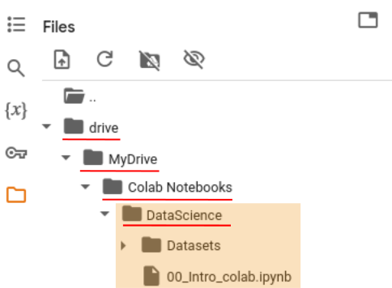


## **ตัวอย่างการ Mount Google Drive และการอ่านเขียนไฟล์ไปยัง Google Drive (โดยใช้โค้ด)**


### Mount Google Drive
```
from google.colab import drive
drive.mount('/content/drive')
```


### Unmount Google Drive
```
drive.flush_and_unmount()
```


### Set path for datasets
```
dataset_path="/content/drive/MyDrive/Colab Notebooks/DataScience/Datasets/"
```


### สร้าง dataframe และจัดเก็บใน Google Drive 

#### สร้าง DataFrame ใหม่และบันทึกในไฟล์ CSV
```
import pandas as pd

# Create a simple dataframe
df = pd.DataFrame({
    'A': [1, 2, 3],
    'B': [4, 5, 6]
})

# Write it to a CSV file in your Google Drive
df.to_csv(dataset_path+'my_file.csv', index=False)
```


#### ใช้ DataFrame จากไฟล์ CSV

```
df = pd.read_csv(dataset_path+'my_file.csv')

# Print the dataframe
print(df)
```

## **โจทย์สร้างข้อมูลต่อไปนี้ในรูปแบบ CSV และจัดเก็บในกล่อง Dataset ในชื่อไฟล์ student.csv**

| **StudentID**  | **FirstName** | **LastName** |
| ------------- | ------------- | ------------- |
| 644295032  | คณากร | บัวหัน |
| 644295033 | ชัชพล  | โพธิ์รัตน์ |
| 644295034 | ซอลาฮูดีน |  มะรง |
