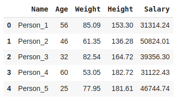
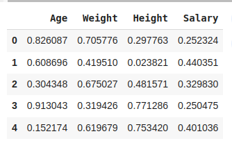
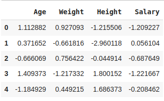

# ตัวอย่างการทำ Data Normalization

ในตัวอย่างนี้ใช้ [Dataset สำหรับทำการ Normalization](Datasets/dataset_to_normalize.csv)  เพื่อทำการแสดงขั้นตอนการทำ Data Normalization ด้วย Python

## 1. อ่านข้อมูลด้วย Pandas

```python
import pandas as pd

df = pd.read_csv('dataset_to_normalize.csv')
df.head()
```

เริ่มต้นด้วยการอ่านข้อมูลจากไฟล์ CSV และแสดงตัวอย่างข้อมูลบางส่วนเพื่อดูโครงสร้างของข้อมูล



## 2. กำหนด Attribute ที่ต้องการ Normalize

```python
# เลือกคอลัมน์ที่ต้องการทำ Normalize (Age, Weight, Height, Salary)
columns_to_normalize = ['Age', 'Weight', 'Height', 'Salary']
```

กำหนดคอลัมน์ที่ต้องการปรับข้อมูลให้เป็นมาตรฐานเพื่อทำให้ค่าข้อมูลอยู่ในช่วงที่เหมาะสม


## 3. Min-Max Normalization

```python
from sklearn.preprocessing import MinMaxScaler

# การ Normalize แบบ Min-Max
min_max_scaler = MinMaxScaler()
df_min_max = pd.DataFrame(min_max_scaler.fit_transform(df[columns_to_normalize]), columns=columns_to_normalize)
df_min_max.head()
```

- Min-Max Normalization จะเปลี่ยนค่าข้อมูลให้อยู่ในช่วง [0, 1] หรือช่วงที่กำหนด
- ค่าที่ได้จะเหมาะสำหรับโมเดลที่ต้องการข้อมูลอยู่ในช่วงจำกัด เช่น การคำนวณระยะทางเชิงเรขาคณิต



## 4. Z-Score Normalization

```python
from sklearn.preprocessing import StandardScaler

# การ Normalize แบบ Z-Score
z_score_scaler = StandardScaler()
df_zscore = pd.DataFrame(z_score_scaler.fit_transform(df[columns_to_normalize]), columns=columns_to_normalize)
df_zscore.head()
```

- Z-Score Normalization จะเปลี่ยนค่าข้อมูลให้มีค่าเฉลี่ยเท่ากับ 0 และค่าเบี่ยงเบนมาตรฐานเท่ากับ 1
- เหมาะกับข้อมูลที่มีค่าแตกต่างกันอย่างมากและต้องการให้มีค่าในมาตราส่วนที่ใกล้เคียงกัน





## 5. การเปรียบเทียบผลลัพธ์

```python
print("ข้อมูลดั้งเดิม")
print(df[columns_to_normalize].describe())

print("ข้อมูลหลังทำ Min-Max Normalization")
print(df_min_max.describe())

print("ข้อมูลหลังทำ Z-Score Normalization")
print(df_zscore.describe())
```

- สามารถใช้ `describe()` เพื่อตรวจสอบค่าเฉลี่ย ค่าต่ำสุด และค่าสูงสุดของข้อมูลหลังการ Normalize


<sup><ins>หมายเหตุ</ins> เอกสารนี้มีการใช้ Generative AI เข้ามาช่วยในการสร้างเอกสารบางส่วน และมีเพิ่มเติมข้อมูล ตลอดจนปรับปรุงข้อมูลเพื่อความเหมาะสมโดยผู้เขียน</sup> 
