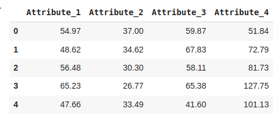
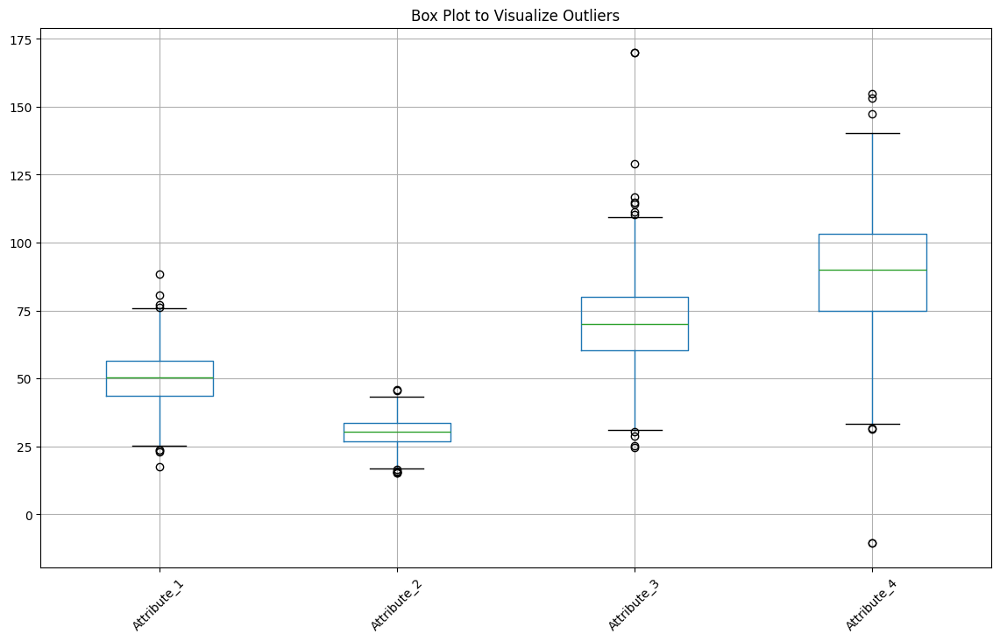
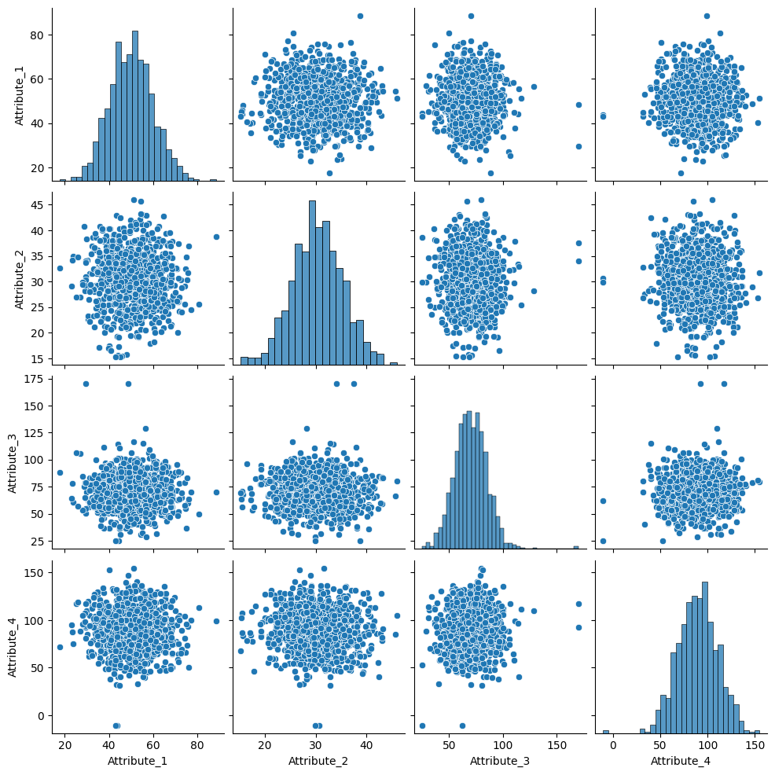
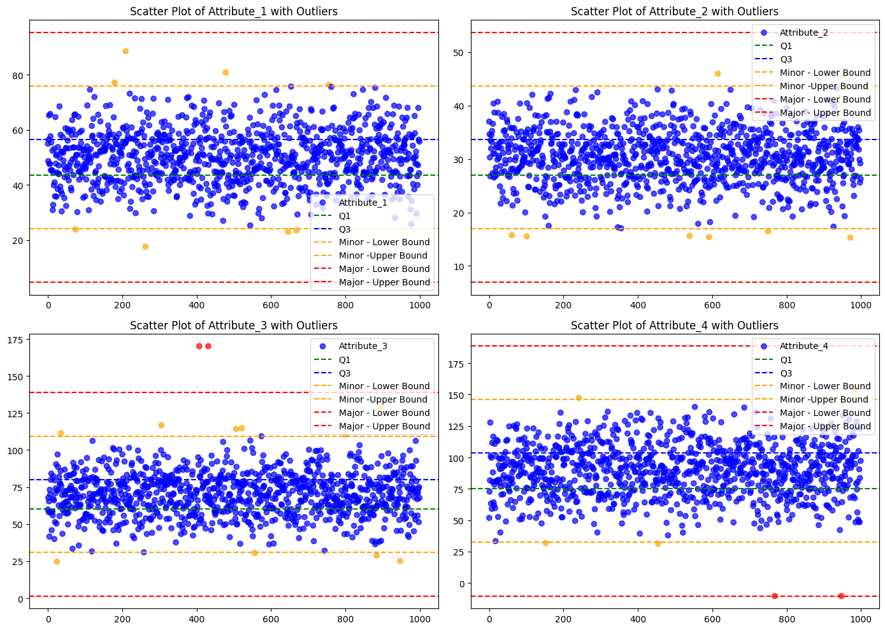
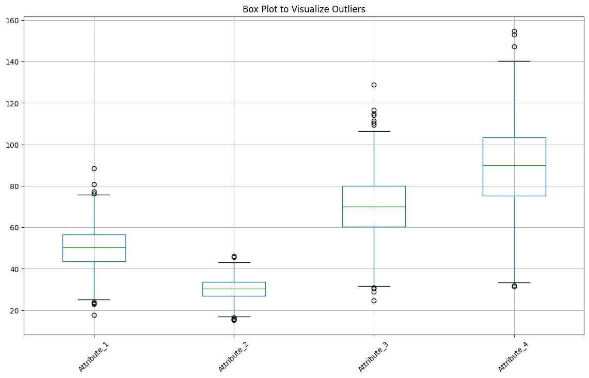
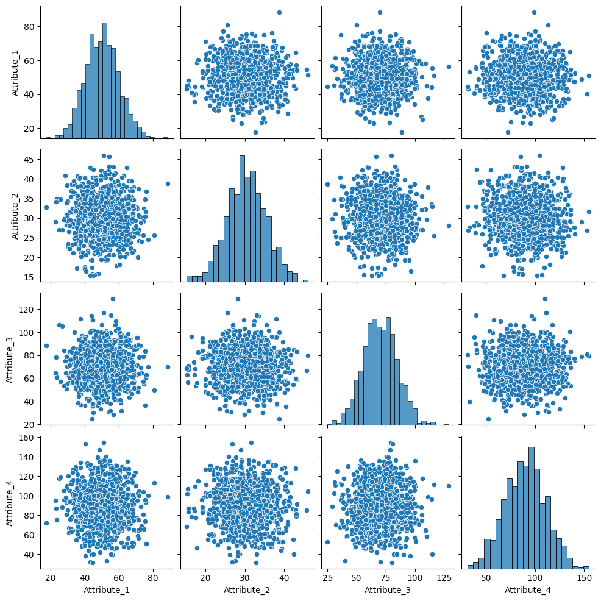
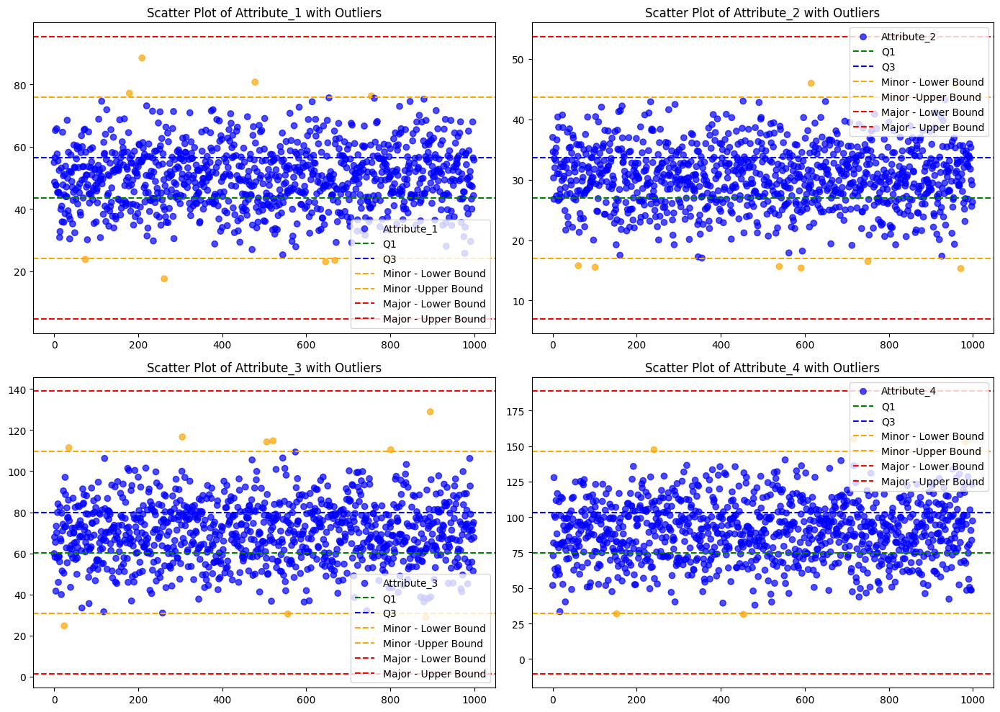

# ตัวอย่างการตรวจจับ Outliers

ในตัวอย่างนี้ใช้ [Dataset with Outlier](Datasets/dataset_with_minor_major_outliers.csv) นี้เพื่อทำการแสดงขั้นตอนการหา Outliers และทำการกรองข้อมูลที่เป็น Outliers ออกจากข้อมูล

## 1. อ่านข้อมูลด้วย Pandas

```python
import pandas as pd

df = pd.read_csv("dataset_with_minor_major_outliers.csv")
df.head()
```

ในขั้นตอนแรก เราจะใช้ `pandas` ในการอ่านข้อมูลจากไฟล์ `.csv` และแสดงตัวอย่างข้อมูลบางส่วนด้วย `head()`





## 2. สำรวจข้อมูลด้วย Box Plot

```python
import matplotlib.pyplot as plt

# Box plot สำหรับทุกคอลัมน์
plt.figure(figsize=(14, 8))
df.boxplot(column=df.columns.to_list(),rot=45 )
plt.title("Box Plot to Visualize Outliers")
plt.show()
```

เราสามารถใช้ Box Plot ในการแสดง Outliers เพื่อให้มองเห็นข้อมูลที่อยู่นอกช่วงปกติในแต่ละคอลัมน์ได้อย่างชัดเจน




## 3. สำรวจข้อมูลด้วย Pairplot

```python
import seaborn as sns

sns.pairplot(df)
```

เราสามารถใช้ Pairplot ในการแสดงความสัมพันธ์ของข้อมูลในแต่ละคอลัมน์ และสามารถเห็น Outliers ได้ง่ายขึ้น



## 4. คำนวณค่า Interquartile Range (IQR)

```python
# คำนวณค่า Q1, Q3 และ IQR
Q1 = df.quantile(0.25)
Q3 = df.quantile(0.75)
IQR = Q3 - Q1
```

ค่า **Q1 (25th percentile)** และ **Q3 (75th percentile)** จะใช้ในการหาค่า **IQR (Interquartile Range)**

- IQR = Q3 - Q1
- ข้อมูลที่อยู่นอกช่วง 1.5 * IQR  อาจถือว่าเป็น Outliers


## 5. ระบุ Outliers แบบ Minor และ Major

```python
# set category by type of outlier (1 - minor, 2 - major, 0 - not outlier)
minor_outliers = (df < (Q1 - 1.5 * IQR)) | (df > (Q3 + 1.5 * IQR))
major_outliers = (df < (Q1 - 3 * IQR)) | (df > (Q3 + 3 * IQR))
outliers = minor_outliers.astype(int) + major_outliers.astype(int)
```

- **Minor Outliers**: ข้อมูลที่อยู่นอกช่วง (Q1 - 1.5 \* IQR) ถึง (Q3 + 1.5 \* IQR)
- **Major Outliers**: ข้อมูลที่อยู่นอกช่วง (Q1 - 3 \* IQR) ถึง (Q3 + 3 \* IQR)


## 6. การแสดงข้อมูล Outliers ด้วย Scatter Plot

```python
import matplotlib.pyplot as plt
from matplotlib.colors import ListedColormap

# Visualize all attributes in subplots (scatter plots)
fig, axes = plt.subplots(2, 2, figsize=(14, 10))

for i, attr in enumerate(df.columns):
    ax = axes[i // 2, i % 2]

    if (len(outliers[attr].unique())>2):
      custom_cmap = ListedColormap(['blue', 'orange', 'red'])
    else:
      custom_cmap = ListedColormap(['blue', 'orange'])

    ax.scatter(df.index, df[attr], label=attr, c=outliers[attr], cmap=custom_cmap, alpha=0.7)

    ax.axhline(Q1[attr], color='green', linestyle='--', label='Q1')
    ax.axhline(Q3[attr], color='blue', linestyle='--', label='Q3')

    ax.axhline(Q1[attr] - (1.5 * IQR[attr]), color='orange', linestyle='--', label='Minor - Lower Bound')
    ax.axhline(Q3[attr] + (1.5 * IQR[attr]), color='orange', linestyle='--', label='Minor -Upper Bound')

    ax.axhline(Q1[attr] - (3 * IQR[attr]), color='red', linestyle='--', label='Major - Lower Bound')
    ax.axhline(Q3[attr] + (3 * IQR[attr]), color='red', linestyle='--', label='Major - Upper Bound')

    ax.set_title(f"Scatter Plot of {attr} with Outliers")
    ax.legend()

plt.tight_layout()
plt.show()
```

ใช้ Scatter Plot ในการแสดงผลข้อมูลทั้งหมดและเน้นข้อมูลที่เป็น Minor และ Major Outliers ด้วยสีที่แตกต่างกัน




## 7. การลบ Major Outliers และเปรียบเทียบข้อมูล

```python
# Remove major outliers using the 3 IQR criteria
cleaned_df = df[~((df < (Q1 - (3 * IQR))) | (df > (Q3 + (3 * IQR)))).any(axis=1)]
print(f"Original data size: {df.shape[0]} rows")
print(f"Cleaned data contains {cleaned_df.shape[0]} rows after removing outliers.")
```

- ข้อมูลที่ถูกลบจะเป็นข้อมูลที่อยู่นอกช่วงของ Major Outliers
- เปรียบเทียบจำนวนข้อมูลก่อนและหลังการลบเพื่อดูผลลัพธ์

สามารถตรวจสอบผลความแตกต่างโดยการทำซ้ำขั้นตอนที่ 2 - 6








## แบบฝึกหัด
1) หาจำนวน Minor และ Major Outliers ในแต่ละคอลัมน์

2) ให้ทำการกำจัด Minor Outliers โดยใช้เงื่อนไข 1.5 IQR และเปรียบเทียบข้อมูลก่อนและหลังการลบ Outliers โดยใช้ Box Plot และ Scatter Plot

<sup><ins>หมายเหตุ</ins> เอกสารนี้มีการใช้ Generative AI เข้ามาช่วยในการสร้างเอกสารบางส่วน และมีเพิ่มเติมข้อมูล ตลอดจนปรับปรุงข้อมูลเพื่อความเหมาะสมโดยผู้เขียน</sup> 
